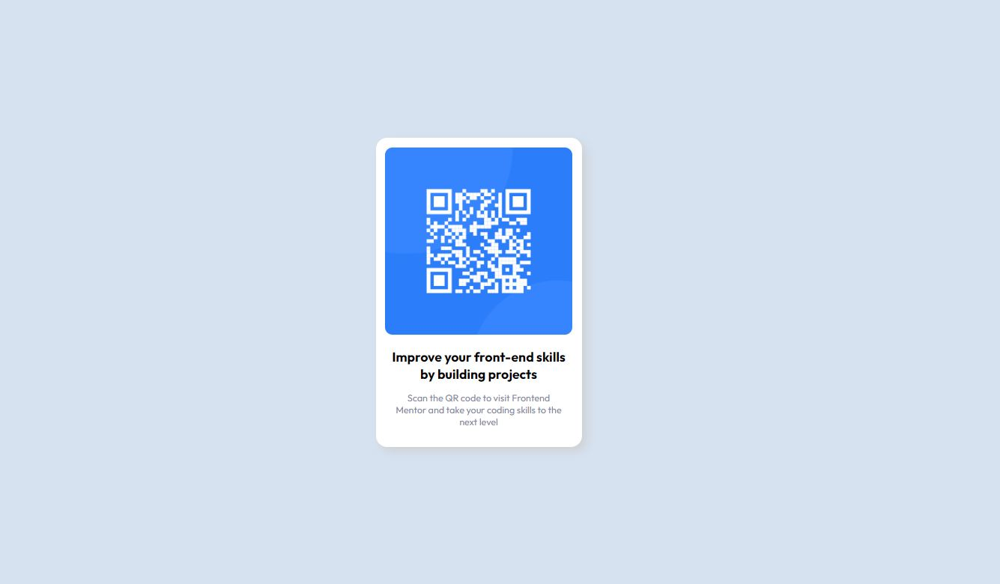
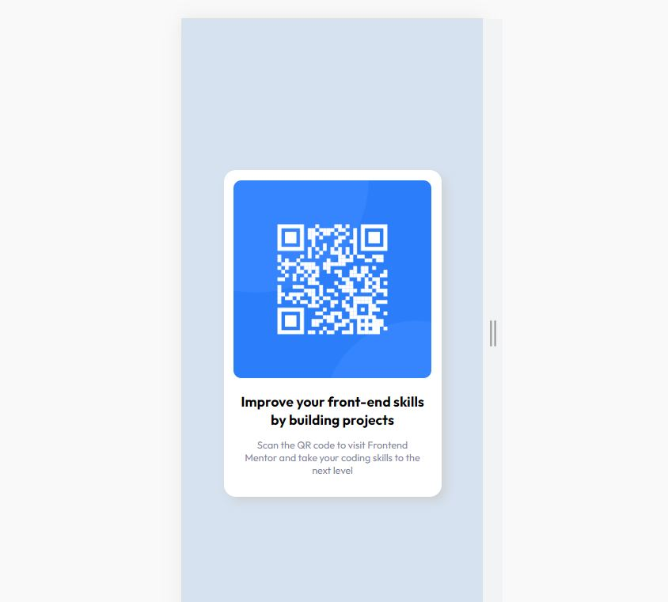

# Frontend Mentor - QR code component solution

This is a solution to the [QR code component challenge on Frontend Mentor](https://www.frontendmentor.io/challenges/qr-code-component-iux_sIO_H). Frontend Mentor challenges help you improve your coding skills by building realistic projects. 

## Table of contents

- [Overview](#overview)
  - [Screenshot](#screenshot)
  - [Links](#links)
- [My process](#my-process)
  - [Built with](#built-with)
- [Author](#author)

## Overview

### Screenshot

### Links

- Solution URL: [https://github.com/danyela2000/qr-code-component-project/tree/main](https://github.com/danyela2000/qr-code-component-project/tree/main)
- Live Site URL: [https://gorgeous-florentine-3f21c8.netlify.app](https://gorgeous-florentine-3f21c8.netlify.app)

## My process

### Built with

- Semantic HTML5 markup
- CSS custom properties
- Flexbox
- Mobile-first workflow

## Author
- Frontend Mentor -[https://www.frontendmentor.io/profile/danyela2000](https://www.frontendmentor.io/profile/danyela2000)

